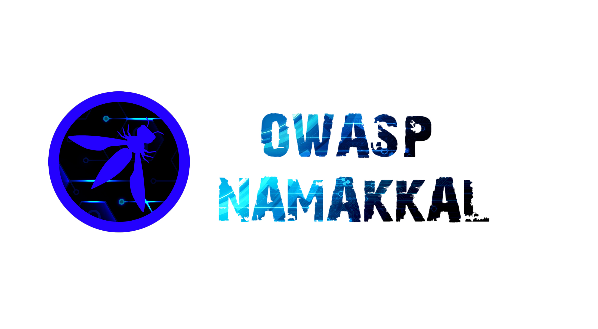
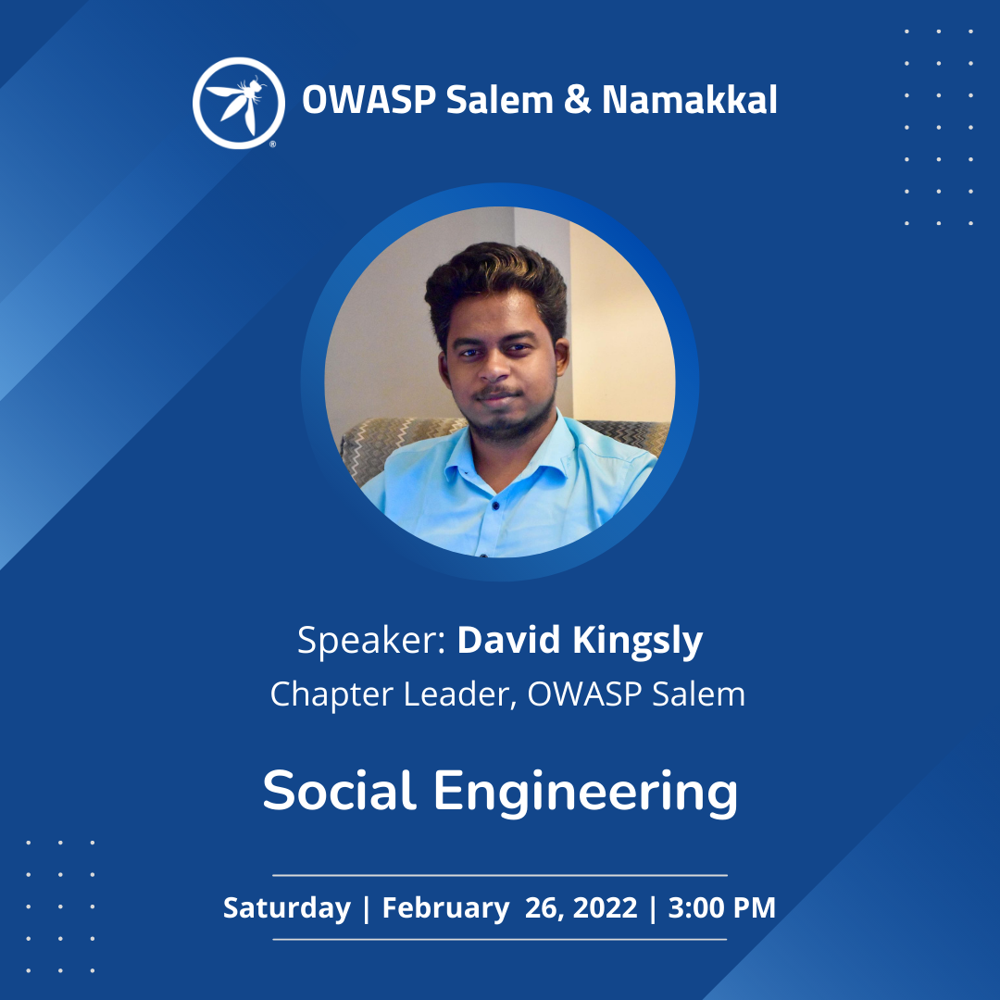

---

layout: col-sidebar
title: OWASP Namakkal
tags: namakkal
region: Asia
meetup-group:  owasp-namakkal-meetup-group

---

OWASP Namakkal was founded in August, 2020. For the Upcoming years, the Namakkal Chapter has going to conduct Meetups, Webinars, and Conferences. All these conferences are open meets where everyone can join and share their knowledge in Application Security. The chapter presents opportunities to the software community in contributing to secure application development.

OWASP provides speakers to Institution of Engineers for Wednesday technical talks related to application security they organize. OWASP also provides speakers to Computer Society of India for technical sessions related to application security they organize.

## Participation
The Open Web Application Security Project (OWASP) is a nonprofit foundation that works to improve the security of software. All of our projects, tools, documents, forums, and chapters are free and open to anyone interested in improving application security. 

Chapters are led by local leaders in accordance with the Chapter Policy. Financial contributions should only be made online using the authorized online donation button. To be a SPEAKER at ANY OWASP Chapter in the world simply review the [speaker agreement](/www-policy/speaker-agreement) and then contact the local chapter leader with details of what OWASP Project, independent research, or related software security topic you would like to present.

Everyone is welcome and encouraged to participate in our [Projects](https://owasp.org/projects/), [Local Chapters](/chapters), [Events](https://owasp.org/events/), [Online Groups](https://groups.google.com/a/owasp.com/), and [Community Slack Channel](https://join.slack.com/t/owaspNamakkal/shared_invite/zt-dzjz7u5t-4Nab~nJKCn7cHkTKY_wu7A). We especially encourage diversity in all our initiatives. OWASP is a fantastic place to learn about application security, to network, and even to build your reputation as an expert. We also encourage you to be [become a member](https://owasp.org/membership/) or consider a [donation](https://owasp.org/donate/?reponame=www-chapter-Namakkal&title=OWASP+Namakkal) to support our ongoing work.

## Speakers

Would you like to speak on the upcoming events on OWASP Namakkal?, contact us via Email
* [Nazeeb Mohammed Rafi](mailto:nazeebmohammed.rafi@owasp.org)
* [David Kingsly](mailto:david.kingsly@owasp.org)
* [Musheed Ahamed](mailto:musheed.ahamed@owasp.org)

**Email Format :**

- Speaker name
- Job Role
- Company / Organization
- Country
- Email ID
- Contact Number
- Speaker Profile
- Presentation Details
    - Name / Title Of the Presentation
    - Abstract Of The Presentation
    - Presentation Time Required

## Upcoming Events
### Social Engineering - Sunday, 27 February 2022, 3:00 PM

- [Registration Link](https://forms.gle/qeCM3SWK8GSvVjvA6)
